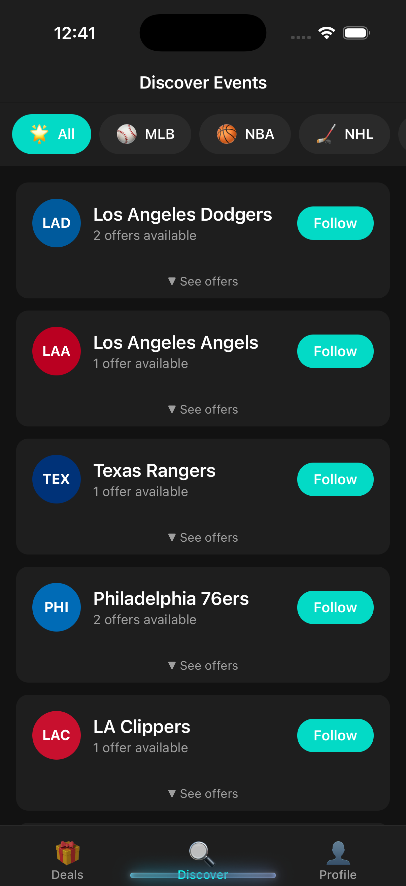
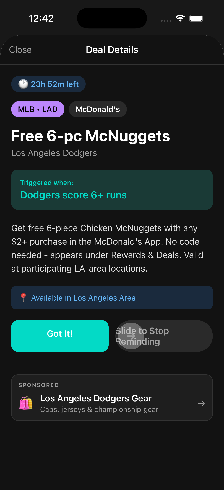
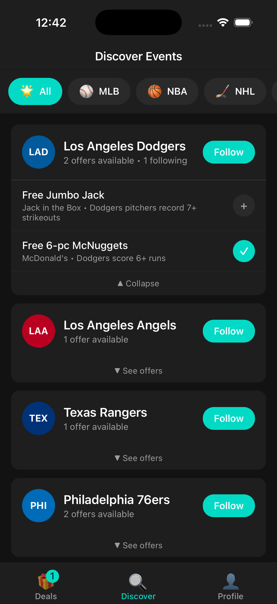
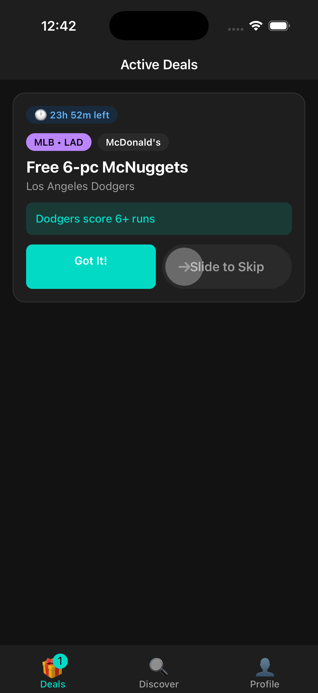
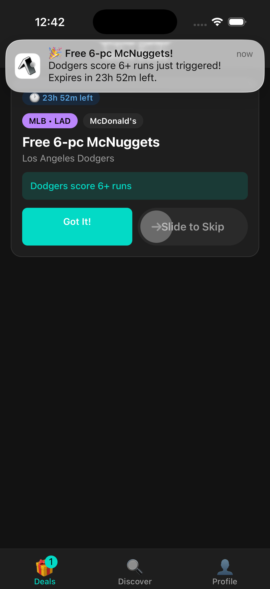

[](LICENSE)
[](https://go.dev)
[](https://reactnative.dev)
[](https://expo.dev)
[](https://apps.apple.com)
[](https://turso.tech)
[](https://mlb.com)
[](https://nba.com)
[](https://nfl.com)
[](https://nhl.com)

# Freebies

Get notified about free offers when your favorite sports teams win or hit milestones.

## Screenshots

<p align="center">
  
  
  
  
  
</p>

## Quick Start

Requires [Task](https://taskfile.dev/) runner.

```bash
task setup          # First-time setup

task api:serve  # Terminal 1: Start backend
task mobile:serve   # Terminal 2: Start mobile app
```

Then press `i` for iOS simulator, `w` for web, or scan QR with Expo Go.

## Documentation

- [Development Guide](docs/development.md) - Local setup and development workflow

### Architecture

- [Backend Architecture](services/api/docs/architecture.md) - DOKS, Turso, Go decisions
- [Mobile Architecture](apps/mobile/docs/architecture.md) - Expo, EAS, state management

## Apps

### Mobile App (`apps/mobile/`)

React Native app built with Expo. Features:

- Browse freebie offers by league (MLB, NBA, NFL, NHL)
- Subscribe to deals you're interested in
- Get notified when deals trigger
- Track active deals with expiration timers

#### Documentation

- [Architecture](apps/mobile/docs/architecture.md)
- [Development Guide](apps/mobile/docs/development.md)
- [App Store Checklist](apps/mobile/APP-STORE.md)
- [Privacy Policy](apps/mobile/PRIVACY-POLICY.md)

### Backend Service (`services/api/`)

Go-based API server that:

- Serves league/team/offer data
- Manages user subscriptions
- Tracks triggered deals and dismissals
- Sends push notifications

#### Documentation

- [Architecture](services/api/docs/architecture.md)
- [Deployment Guide](services/api/docs/deployment.md)
- [CLI Reference](services/api/docs/cli.md)
- [Development Guide](services/api/docs/development.md)
- [API Reference](services/api/docs/api.md)

### Scheduler (`services/scheduler/`)

Lightweight Go CLI that runs as a Kubernetes CronJob. Polls live game data and calls API internal
endpoints to trigger notifications when deal conditions are met.

## Data

All offer data is managed through SQL migrations in `services/api/internal/db/migrations/`:

- `001_schema.sql` - Database schema
- `002_initial_leagues.sql` - MLB, NBA, NFL, NHL leagues
- `003_mlb_data.sql` - MLB teams and offers
- `004_nba_data.sql` - NBA teams and offers
- `005_nfl_data.sql` - NFL teams and offers
- `006_nhl_data.sql` - NHL teams and offers

To add new offers, create a new migration file (e.g., `007_add_new_team.sql`).

## Prerequisites

- Node.js 20+ (for mobile app)
- Go 1.25+ (for backend)
- [Task](https://taskfile.dev/) (task runner)
- [EAS CLI](https://docs.expo.dev/eas/) (for mobile builds)
- [mise](https://mise.jdx.dev/) (optional, for version management)

## License

The [MIT](LICENSE) License.
